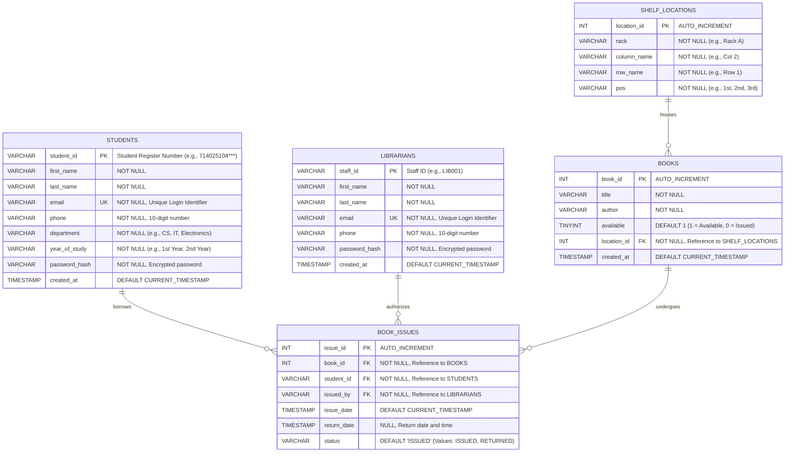

# SIET Smart Library Book Locator - Database Entity-Relationship Diagram (ERD)

This document provides a comprehensive overview of the database design for the **SIET Smart Library Book Locator** system. It models the core entities, attributes, data types, constraints, and relationships required to support student search, library inventory management, and book issuance tracking.

---

## 1. Entity-Relationship Diagram (ERD)

Below is the visual database representation using Mermaid.js syntax.

---

## 2. Entity Descriptions and Attribute Details

### 2.1 STUDENTS (Student Registration)
Stores information for students who register and log in to search the library catalog.
- **`student_id` (PK)**: The primary key, matching the unique Register Number format used by SIET college (`714025104***`).
- **`email` (UK)**: Student email address, verified as unique for login validation.
- **`department`**: Represents the student's branch (e.g., Computer Science, Information Technology, AIDS, AIML, Electronics, Mechanical, Civil).
- **`year_of_study`**: The current academic year (e.g., 1st Year, 2nd Year, 3rd Year, 4th Year).

### 2.2 LIBRARIANS (Library Staff)
Stores library staff profiles responsible for updating inventory and issuing books.
- **`staff_id` (PK)**: Unique staff identifier (e.g., `LIB001`).
- **`email` (UK)**: Librarian's login email.

### 2.3 SHELF_LOCATIONS (Physical Map)
Represents physical locations inside the college library. Separating location data from the book metadata prevents duplicate strings and maintains spatial organization.
- **`location_id` (PK)**: Auto-incremented ID for each unique coordinate slot in the library.
- **`rack`**: The library rack identifier (e.g., "Rack 1").
- **`column_name`**: Vertical divider (e.g., "Col 2").
- **`row_name`**: Horizontal shelf row (e.g., "Row 3").
- **`pos`**: Exact position slot on the shelf (e.g., "1st", "2nd").
- **Composite Unique Constraint**: A physical library spot cannot hold conflicting data; therefore, a composite unique constraint is placed on `(rack, column_name, row_name, pos)`.

### 2.4 BOOKS (Book Inventory)
Stores details about the books available in the SIET library catalog.
- **`book_id` (PK)**: Auto-incremented library accession number.
- **`available`**: A boolean flag (stored as `TINYINT(1)`) where `1` indicates the book is on the shelf and searchable, and `0` indicates it has been issued or is undergoing maintenance.
- **`location_id` (FK)**: Relates a book to its exact coordinates in `SHELF_LOCATIONS`.

### 2.5 BOOK_ISSUES (Transactions)
Tracks the lifecycle of book loans, establishing audit trails of which student borrowed which book and which librarian approved it.
- **`issue_id` (PK)**: Unique transaction number.
- **`book_id` (FK)**: References the specific copy of the book being issued.
- **`student_id` (FK)**: References the borrower.
- **`issued_by` (FK)**: References the staff member who approved the loan.
- **`issue_date`**: Records the timestamp when the book left the library.
- **`return_date`**: Records when the book was checked back in. Starts as `NULL` upon issuance.
- **`status`**: Trackable state: either `'ISSUED'` or `'RETURNED'`.

---

## 3. Relationship Logic and Cardinality Constraints

- **`SHELF_LOCATIONS` to `BOOKS` (1:N)**:
  - **Cardinality**: One shelf location can house zero, one, or multiple books (e.g., books stacked together). However, a specific book copy can only reside in exactly **one** designated shelf location at a time.
  - **Constraint**: `location_id` in `BOOKS` is a Foreign Key referencing `SHELF_LOCATIONS(location_id)`.

- **`STUDENTS` to `BOOK_ISSUES` (1:N)**:
  - **Cardinality**: A student can borrow zero, one, or multiple books over time (generating multiple issue records). An individual issuance transaction, however, belongs to exactly **one** student.
  - **Constraint**: `student_id` in `BOOK_ISSUES` is a Foreign Key referencing `STUDENTS(student_id)`.

- **`LIBRARIANS` to `BOOK_ISSUES` (1:N)**:
  - **Cardinality**: A librarian can authorize multiple book issuance operations. Each transaction record is logged under exactly **one** authorizing librarian staff member.
  - **Constraint**: `issued_by` in `BOOK_ISSUES` is a Foreign Key referencing `LIBRARIANS(staff_id)`.

- **`BOOKS` to `BOOK_ISSUES` (1:N)**:
  - **Cardinality**: Over its lifecycle, a book can be issued and returned multiple times, creating multiple historical issue logs. A specific issue transaction record, however, represents the checkout of exactly **one** book.
  - **Constraint**: `book_id` in `BOOK_ISSUES` is a Foreign Key referencing `BOOKS(book_id)`.
